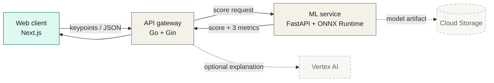

<p align="center">
  
</p>

<p align="center">
  <strong>Archived build log · 2025</strong><br />
  15秒のモーションを、ひとつのスコアへ。
</p>

<p align="center">
  <code>Next.js</code>&nbsp;&nbsp;
  <code>Go</code>&nbsp;&nbsp;
  <code>FastAPI</code>&nbsp;&nbsp;
  <code>ONNX Runtime</code>&nbsp;&nbsp;
  <code>Terraform</code>&nbsp;&nbsp;
  <code>Google Cloud</code>
</p>

> [!NOTE]
> Piccaは開発を終了した短期プロトタイプです。完成品として見せるのではなく、Web・API・ML・クラウド運用を横断して得た設計判断と学びを残す技術ログとして整理しています。

## この記録について

Piccaは、短いモーションから得た身体のキーポイント列を解析し、0-100のスコアと `Symmetry`・`Power`・`Consistency` の3指標へ変換する技術検証です。

もともとはハッカソン向けに短期間で作ったPoCでした。現在のリポジトリは、次の4点を後から読み返せる形で保存することを目的にしています。

- 実際にどこまで作ったか
- なぜサービスや技術を分けたか
- どこで複雑さが増えたか
- 今なら何を小さく、どう作り直すか

詳しい振り返りは [Technical Retrospective](docs/RETROSPECTIVE.md) にまとめています。

## 触った技術領域

| Area | What I explored | Stack |
| --- | --- | --- |
| Web experience | モーション計測から結果表示までの画面設計とAPI接続 | Next.js, React, TypeScript |
| API gateway | API key認証、request ID、タイムアウト、ヘルスチェック、graceful shutdown | Go, Gin |
| ML serving | キーポイントの前処理、ONNXモデルの読み込み・ハッシュ検証・推論API | Python, FastAPI, ONNX Runtime |
| Cloud / delivery | コンテナ分割、Cloud Run構成、モデル保管、CI/CD、IaC | Docker, GCP, Cloud Build, Terraform |
| Operations | SLO、runbook、構造化ログ、ベンチマークと可視化 | pytest, Go test, JSONL, Matplotlib |

## アーキテクチャ



UI・ゲートウェイ・推論を分けたことで責務は明確になりました。一方、短期PoCとしてはサービス間契約、環境変数、デバッグ経路が増え、構成を分けること自体のコストも学ぶ結果になりました。

## 当時の選択と、今なら変えること

| 当時の選択 | 得た学び | 今なら |
| --- | --- | --- |
| Next.js・Go・Pythonを別サービス化 | 言語ごとの責務は明確になるが、境界の数だけ契約と障害点が増える | 最初はWeb/APIと推論の二層に絞り、独立して伸ばす理由ができてから分割する |
| ONNX Runtimeで推論 | 配布形式を揃えられる一方、前処理と入出力shapeもモデル契約の一部になる | exportからAPI応答までを固定fixtureで通すスモークテストを先に作る |
| キーポイント中心の入力 | データを小さくできるが、座標系・fps・点数の定義が暗黙だと再現性が落ちる | schema versionと正規化ルールを明示し、境界で厳密に検証する |
| TerraformとCloud Buildまで実装 | アプリ以外の運用面を学べたが、PoCの検証対象が広がった | 先にローカル再現性と一本のデプロイ経路を完成させ、IaCは必要な範囲から育てる |
| health・ログ・SLOを後半に追加 | 動くことと、状態を説明できることは別だった | 最小限の観測項目と失敗時の確認手順を最初に決める |

## 学習の軌跡

1. Next.jsでWebの入口とAPI routeを作る
2. PyTorchモデルをONNXへ書き出し、FastAPIで推論する
3. Go gatewayで認証・routing・timeoutをまとめる
4. Docker・Cloud Run・Terraform・Cloud Buildをつなぐ
5. health / readiness、run ID、構造化ログ、SLO、runbookを追加する
6. 実装済み・計画・振り返りを分けて、この学習ログへ整理する

## ローカルで記録ページを見る

```bash
git clone https://github.com/Udonburo/picca.git
cd picca
npm ci
npm run dev
```

ブラウザで [http://localhost:3000](http://localhost:3000) を開いてください。トップページは記録を読むための静的な画面です。

## Repository map

```text
picca/
├─ src/app/            # Technical learning log UI (Next.js)
├─ services/api-go/    # Go API gateway and operations endpoints
├─ services/ml_py/     # FastAPI + ONNX inference service
├─ infra/              # Archived Terraform / Cloud Build configuration
├─ ops/lachesis/       # SLO and runbook
├─ tests/              # Model export and prediction tests
├─ tools/              # Benchmarking and plotting utilities
└─ docs/               # Retrospective, public extracts, and original notes
```

## Reference documents

以下はプロトタイプ制作時点の資料です。将来計画や当時の目標値を含むため、現在の実装を説明するREADME・振り返りとは役割を分けています。

- [Technical Retrospective](docs/RETROSPECTIVE.md)
- [Tech Architecture](docs/public/01_Tech_Architecture.pdf)
- [Original README (JP / EN)](docs/public/02_Readme.pdf)
- [Product Overview](docs/public/03_Product_Overview.pdf)
- [Data Privacy & Ethical UX](docs/public/04_Data_Privacy%26ethical_Ux.pdf)
- [Contributing Guide](docs/public/05_Contributing.pdf)
- [Code of Conduct](docs/public/Code_Of_Conduct.pdf)
- [License](docs/public/License.pdf)

---

<p align="center">
  Built as a short-lived prototype. Preserved as a technical learning log.
</p>
