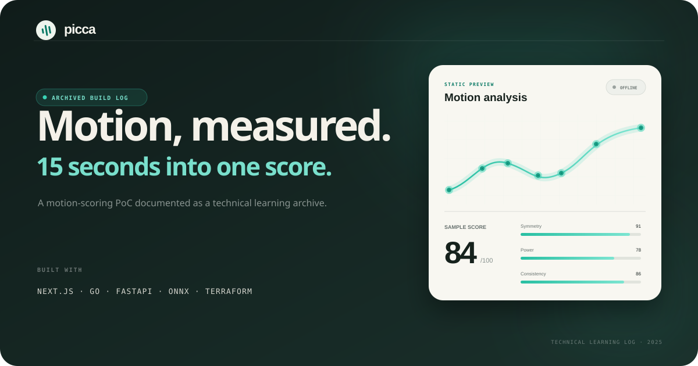
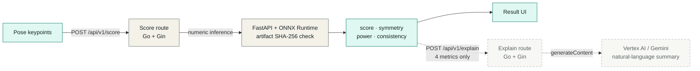

<p align="center">
  
</p>

<h1 align="center">Picca</h1>

<p align="center">
  <strong>End-to-end motion scoring PoC · Technical learning log</strong><br />
  <sub>Archived in 2025 · 15秒のモーションを、ひとつのスコアへ。</sub>
</p>

<p align="center">
  <a href="https://github.com/Udonburo/picca/actions/workflows/ci.yml"></a>
  <a href="https://github.com/Udonburo/picca/actions/workflows/go-gateway.yml"></a>
  <a href="./LICENSE"></a>
</p>

<p align="center">
  <code>Next.js</code>&nbsp;&nbsp;
  <code>Go</code>&nbsp;&nbsp;
  <code>FastAPI</code>&nbsp;&nbsp;
  <code>ONNX Runtime</code>&nbsp;&nbsp;
  <code>Terraform</code>&nbsp;&nbsp;
  <code>Google Cloud</code>
</p>

> [!NOTE]
> Piccaは開発を終了した短期プロトタイプです。ホスト済みのデモとクラウド環境は現在稼働していません。完成品として見せるのではなく、Web・API・ML・クラウド運用を横断して得た設計判断と学びを残す技術ログとして整理しています。

**Quick read:** [Project Brief (EN)](docs/PROJECT_BRIEF.md) · [Technical Retrospective (JP)](docs/RETROSPECTIVE.md)

## この記録について

Piccaは、短いモーションから得た身体のキーポイント列を解析し、0-100のスコアと `Symmetry`・`Power`・`Consistency` の3指標へ変換する技術検証です。

> [!IMPORTANT]
> **設計の核は、数値評価と生成的な説明を別レイヤとして実装したことです。** `POST /api/v1/score` はFastAPI / ONNX Runtimeへ数値推論を委譲し、設定されたSHA-256とモデルartifactを照合して4指標を返します。別経路の `POST /api/v1/explain` は、その4指標だけをVertex AI / Gemini（既定: `gemini-2.5-flash-lite`）へ渡して自然言語の説明を生成します。生成モデルに採点を担わせず、artifactを照合する数値評価と表現の柔軟性を切り離しました。

もともとはハッカソン向けに短期間で作ったPoCでした。現在のリポジトリは、次の4点を後から読み返せる形で保存することを目的にしています。

- 実際にどこまで作ったか
- なぜサービスや技術を分けたか
- どこで複雑さが増えたか
- 今なら何を小さく、どう作り直すか

詳しい振り返りは [Technical Retrospective](docs/RETROSPECTIVE.md) にまとめています。

## 実装・検証した領域

| Area | What I explored | Stack |
| --- | --- | --- |
| Web experience | 技術ログ画面、静的な結果モック、推論API routeの境界 | Next.js, React, TypeScript |
| API gateway | score / explainの経路分離、API key認証、request ID、タイムアウト、graceful shutdown | Go, Gin |
| ML serving | キーポイントの前処理、ONNXモデルのSHA-256照合・数値推論 | Python, FastAPI, ONNX Runtime |
| Generative explanation | 4つの推論結果だけを入力にした自然言語フィードバック | Vertex AI, Gemini |
| Cloud / delivery | コンテナ分割、Cloud Run構成、モデル保管、CI/CD、IaC | Docker, GCP, Cloud Build, Terraform |
| Operations | SLO、runbook、構造化ログ、ベンチマークと可視化 | pytest, Go test, JSONL, Matplotlib |

## アーキテクチャ



`/score` と `/explain` は意図的に独立しています。Geminiへraw keypointsは渡さず、スコアの決定にも使いません。そのため、生成的な説明を使わない場合でも数値結果は単独で成立します。UI・ゲートウェイ・推論を分けたことで責務は明確になった一方、短期PoCとしてはサービス間契約、環境変数、デバッグ経路が増え、構成を分けること自体のコストも学ぶ結果になりました。

**Code evidence:** [score / explain routes](services/api-go/main.go#L131-L143) · [ONNX artifact verification and inference](services/ml_py/model.py#L23-L54) · [Gemini request and response handling](services/api-go/main.go#L327-L460)

## 当時の選択と、今なら変えること

| 当時の選択 | 得た学び | 今なら |
| --- | --- | --- |
| Next.js・Go・Pythonを別サービス化 | 言語ごとの責務は明確になるが、境界の数だけ契約と障害点が増える | 最初はWeb/APIと推論の二層に絞り、独立して伸ばす理由ができてから分割する |
| ONNX Runtimeで推論 | 配布形式を揃えられる一方、前処理と入出力shapeもモデル契約の一部になる | exportからAPI応答までを固定fixtureで通すスモークテストを先に作る |
| 数値推論と生成説明を別API化 | 評価の再現性を保ったまま、説明モデルやpromptを交換できる | score schemaとprompt versionを記録し、説明不能時のfallbackも定義する |
| キーポイント中心の入力 | データを小さくできるが、座標系・fps・点数の定義が暗黙だと再現性が落ちる | schema versionと正規化ルールを明示し、境界で厳密に検証する |
| TerraformとCloud Buildまで実装 | アプリ以外の運用面を学べたが、PoCの検証対象が広がった | 先にローカル再現性と一本のデプロイ経路を完成させ、IaCは必要な範囲から育てる |
| health・ログ・SLOを後半に追加 | 動くことと、状態を説明できることは別だった | 最小限の観測項目と失敗時の確認手順を最初に決める |

## 学習の軌跡

1. Next.jsでWebの入口とAPI routeを作る
2. PyTorchモデルをONNXへ書き出し、FastAPIで推論する
3. Go gatewayで認証・routing・timeoutをまとめる
4. 数値結果とは別のexplain routeを設け、Vertex AI / Geminiで説明を生成する
5. Docker・Cloud Run・Terraform・Cloud Buildをつなぐ
6. health / readiness、run ID、構造化ログ、SLO、runbookを追加する
7. 実装済み・計画・振り返りを分けて、この学習ログへ整理する

## ローカルで記録ページを見る

```bash
git clone https://github.com/Udonburo/picca.git
cd picca
npm ci
npm run dev
```

ブラウザで [http://localhost:3000](http://localhost:3000) を開いてください。トップページは記録を読むための静的な画面です。

## Quality checks

公開コードは、GitHub Actions上で次の境界を継続的に確認します。停止済みのGCP環境へのデプロイ処理は含みません。

| Area | Checks |
| --- | --- |
| Web | ESLint, Jest, Next.js production build |
| Python / ML | Ruff, pytest, ONNX export and inference smoke tests |
| Go gateway | `go vet`, `go test -race` |
| Repository | Gitleaks and workflow naming rules |

## Repository map

```text
picca/
├─ src/app/            # Technical learning log UI (Next.js)
├─ services/api-go/    # Go API gateway and operations endpoints
├─ services/ml_py/     # FastAPI + ONNX inference service
├─ infra/              # Archived Terraform / Cloud Build configuration
├─ ops/lachesis/       # SLO and runbook
├─ tests/              # Model export and prediction tests
├─ tools/              # Benchmarking and plotting utilities
└─ docs/               # Brief, retrospective, and historical materials
```

## Historical materials

現在の到達点と学びは [Technical Retrospective](docs/RETROSPECTIVE.md) に記録しています。

<details>
<summary>ハッカソン提出時点の資料を見る</summary>

以下は制作当時の資料で、将来計画や当時の目標値も含みます。現在の実装を示す証拠ではなく、意思決定の背景を残すための履歴です。

- [Tech Architecture](docs/public/01_Tech_Architecture.pdf)
- [Original README (JP / EN)](docs/public/02_Readme.pdf)
- [Product Overview](docs/public/03_Product_Overview.pdf)
- [Data Privacy & Ethical UX](docs/public/04_Data_Privacy%26ethical_Ux.pdf)
- [Contributing Guide](docs/public/05_Contributing.pdf)
- [Code of Conduct](docs/public/Code_Of_Conduct.pdf)
- [License](docs/public/License.pdf)

</details>

## License

Source code is available under the [Apache License 2.0](LICENSE).

---

<p align="center">
  Built as a short-lived prototype. Preserved as a technical learning log.
</p>
