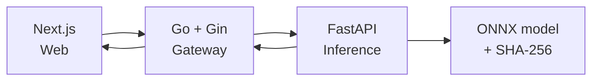

# Picca — Project Brief

> Archived engineering log · Motion-scoring proof of concept · 2025

Picca explored one end-to-end question: can a short sequence of body keypoints be turned into feedback that is immediate, reproducible, and explainable? The repository preserves the resulting prototype and the engineering decisions behind it; its hosted services have been retired.

## At a glance

| | |
| --- | --- |
| **Input** | Frame rate and a time-ordered sequence of 2D keypoints |
| **Output** | Overall score plus symmetry, power, and consistency indicators |
| **System** | Next.js web layer → Go gateway → FastAPI / ONNX inference |
| **Engineering scope** | API boundaries, model packaging, deployment, observability, and CI |
| **Current status** | Archived learning record; no hosted demo or production claims |

## System boundary

The three-service split made responsibilities explicit, but it also introduced contracts, environment configuration, timeout handling, and cross-service debugging. That trade-off became one of the main outcomes of the prototype.

## What is implemented

- A static Next.js archive page, a clearly labeled result mock, and API routes for forwarding motion data.
- A Go gateway with API-key authentication, request IDs, upstream timeouts, health checks, and graceful shutdown.
- A FastAPI inference service with keypoint preprocessing, ONNX Runtime execution, model hash verification, and typed responses.
- Docker, Terraform, and Cloud Build experiments, plus SLO, runbook, structured logging, and benchmark tooling.
- Automated checks for the web, Python, Go, workflow conventions, and secret leakage.

## Engineering takeaways

| Decision | What it revealed | What I would do now |
| --- | --- | --- |
| Separate web, gateway, and inference services | Clear ownership comes with more contracts and failure points | Start with two boundaries and split only when scaling or security requires it |
| Use ONNX as the inference boundary | A model file is not reproducible without preprocessing and schema versions | Package artifact, hash, schema, and preprocessing version as one manifest |
| Add operations after the happy path | A working response does not explain where or why a request failed | Define request IDs, health semantics, and minimum logs at the start |

## Evidence map

- [`src/app/`](../src/app/) — archive UI, static result mock, and API routes
- [`services/api-go/`](../services/api-go/) — gateway and operational boundaries
- [`services/ml_py/`](../services/ml_py/) — preprocessing and ONNX inference
- [`tests/`](../tests/) — export and prediction smoke tests
- [`infra/`](../infra/) — archived infrastructure experiments
- [`ops/lachesis/`](../ops/lachesis/) — SLO and runbook
- [`RETROSPECTIVE.md`](RETROSPECTIVE.md) — detailed decisions, failures, and lessons

---

This brief describes implemented repository evidence, not the broader goals contained in the original hackathon materials.
