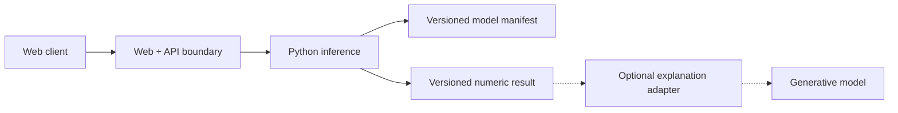

# Picca — Technical Retrospective

> Status: archived · Scope: motion scoring PoC · Written as a learning record

## 1. 最初に確かめたかったこと

短い身体動作をキーポイント列へ変換し、すぐ理解できるフィードバックを返せるか。Piccaでは、この問いを次の小さな入出力に落としました。

```text
input   = fps + [{ x, y }, ...]
output  = score + symmetry + power + consistency
```

検証はモデル精度だけでは終わりません。ブラウザから入力を受け取り、安全に推論へ渡し、結果を返し、失敗した場所を追えるところまでを一つの流れとして実装しました。

## 2. 作ったもの

| Layer | Implementation | 学習したテーマ |
| --- | --- | --- |
| Web | Next.js / React / TypeScript | 入力から結果までの体験、API境界 |
| Gateway | Go / Gin | 認証、timeout、request ID、graceful shutdown |
| Inference | FastAPI / ONNX Runtime | 前処理、モデル配布、入出力schema |
| Explanation | Vertex AI / Gemini | 数値評価と自然言語フィードバックの分離 |
| Infrastructure | Docker / Cloud Run / Terraform | service account、artifact、IaC、CI/CD |
| Operations | health / readiness / JSONL / SLO | 観測可能性、再現性、障害時の確認手順 |

## 3. 設計判断とトレードオフ

### Go gatewayとPython inferenceを分ける

**狙い**

- HTTP境界の処理とMLランタイムを分離する
- 推論側をPythonのライブラリエコシステムに寄せる
- gateway側で認証、timeout、request IDを統一する

**実際に分かったこと**

責務は読みやすくなりましたが、サービス間のURL、環境変数、エラー変換、起動順、ログの相関が必要になりました。分割は整理ではあるものの、無料で得られる整理ではありません。

**今なら**

短期PoCではWeb/APIと推論の二層から始めます。gatewayを独立させるのは、認証境界、個別のスケーリング、複数クライアント対応など、分ける理由が実際に生まれた時点にします。

### ONNXを推論境界にする

**狙い**

- 学習コードと推論コードの依存を切る
- CPU環境で同じartifactを読み込めるようにする
- SHA-256でモデルの取り違えを検出する

**実際に分かったこと**

モデルファイルだけ一致しても、前処理、入力shape、sampling、出力の意味がずれると同じ結果にはなりません。モデル契約はartifact単体ではなく、前後の処理を含みます。

**今なら**

モデルversion、hash、input schema、preprocessing versionを一つのmanifestにします。固定fixtureを使い、export後のONNXからAPI responseまでをCIで一度通します。

### 数値評価と生成的な説明を分ける

**狙い**

- `/api/v1/score` の採点をFastAPI / ONNX Runtimeへ閉じる
- `/api/v1/explain` は `score`・`symmetry`・`power`・`consistency` だけを受け取る
- 説明モデルやpromptの変更を、数値評価の定義から切り離す

**実際に分かったこと**

生成モデルは自然な言い換えには向きますが、採点まで担わせると、モデル更新やprompt変更が評価値の再現性に影響します。Piccaでは固定artifactから数値を返す経路と、その結果をVertex AI / Geminiで説明する経路をAPI単位で分けました。Geminiにraw keypointsは渡さず、説明が利用できない場合も数値結果は独立して扱えます。

**今なら**

score schema、model hash、prompt version、生成モデルIDを一つの観測単位として記録します。説明側には入力範囲の検証とtimeoutに加え、定型文へ戻せるfallbackを用意します。

### キーポイントだけを入力にする

**狙い**

- 映像そのものではなく、推論に必要な情報へ入力を絞る
- payloadと処理量を小さくする
- UIと推論の契約を単純にする

**実際に分かったこと**

`x` と `y` の配列だけでは契約として不足します。座標系、正規化範囲、点の並び、欠損値、fps、必要なサンプル数まで定義して、初めて再現可能な入力になります。

**今なら**

schema versionを必須にし、境界で範囲・点数・時系列順を検証します。raw inputと前処理後inputのfixtureを両方残します。

### インフラと運用までPoCへ含める

**狙い**

- ローカルで動くモデルを、デプロイ可能なサービスとして扱う
- TerraformとCloud Buildで構成を履歴化する
- health、readiness、ログ、SLOまで一度触る

**実際に分かったこと**

学べる範囲は大きくなりましたが、プロダクト仮説と基盤仮説を同時に検証する形になりました。何が本当のボトルネックだったかを判断しづらくなる場面もありました。

**今なら**

最初にローカルで再現できる一本のhappy pathを完成させます。その後、デプロイ、IaC、観測可能性を一段ずつ追加し、各段階の完了条件を分けます。

## 4. 難しかったところ

### サービスをまたぐ失敗を追うこと

ブラウザ、gateway、inferenceのどこで失敗したのかをHTTP statusだけで判断するのは困難でした。request ID、reason code、upstream timeout、構造化ログを追加したことで、ようやく一つの処理として追えるようになりました。

### モデルとAPIの再現性を揃えること

同じモデル名でも、中身、前処理、入力shapeが違えば結果は変わります。artifact hashとrun IDを残す実装は、スコアそのものより「どの条件で出た結果か」を説明するためのものでした。

### 計画と実装済みを分けること

短期開発では、構想、目標、実装済みの機能が同じ資料に並びがちです。後から読むと完成範囲が曖昧になるため、このリポジトリではREADMEを現状、retrospectiveを学び、過去資料を当時の計画として分けました。

## 5. 今ならこう始める



1. 代表的なキーポイントfixtureと期待responseを最初に決める
2. Python内で前処理からONNX推論までを通す
3. 一つのAPI境界を追加し、schemaとtimeoutを固定する
4. Webから同じfixtureを送り、end-to-end testを作る
5. 数値結果が単独で成立してから、任意の説明レイヤを追加する
6. request ID、health、構造化ログを最小構成で入れる
7. 必要になった境界だけを独立サービスへ分ける

構成を小さくするのは、学ぶ範囲を狭めるためではありません。何を検証しているかを一度に一つずつ説明できるようにするためです。

## 6. Code reading guide

- [`src/app/`](../src/app/) — 学習ログとして整理した現在の入口
- [`services/api-go/`](../services/api-go/) — gateway、health、operations middleware
- [`services/ml_py/`](../services/ml_py/) — FastAPI、preprocessing、ONNX inference
- [`infra/`](../infra/) — TerraformとCloud Buildの試行
- [`ops/lachesis/`](../ops/lachesis/) — SLOとrunbook
- [`tools/bench_picca.py`](../tools/bench_picca.py) — API benchmark
- [`tools/plot_ops_fig1.py`](../tools/plot_ops_fig1.py) — benchmark結果の可視化

---

この記録の結論は「多くの技術を使った」ことではなく、**境界を増やす理由、評価と説明を分ける意味、結果を再現する条件、動作を説明するための観測**を具体的に学べたことです。
